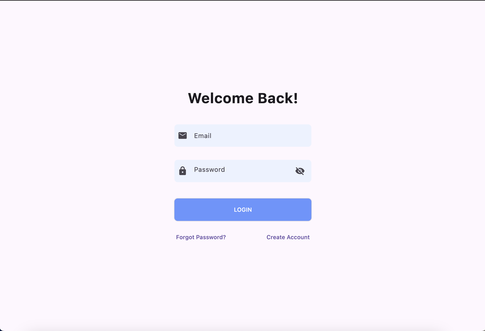
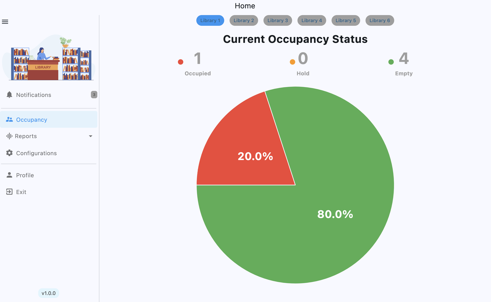
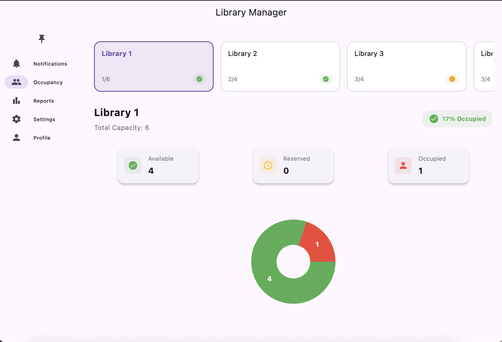
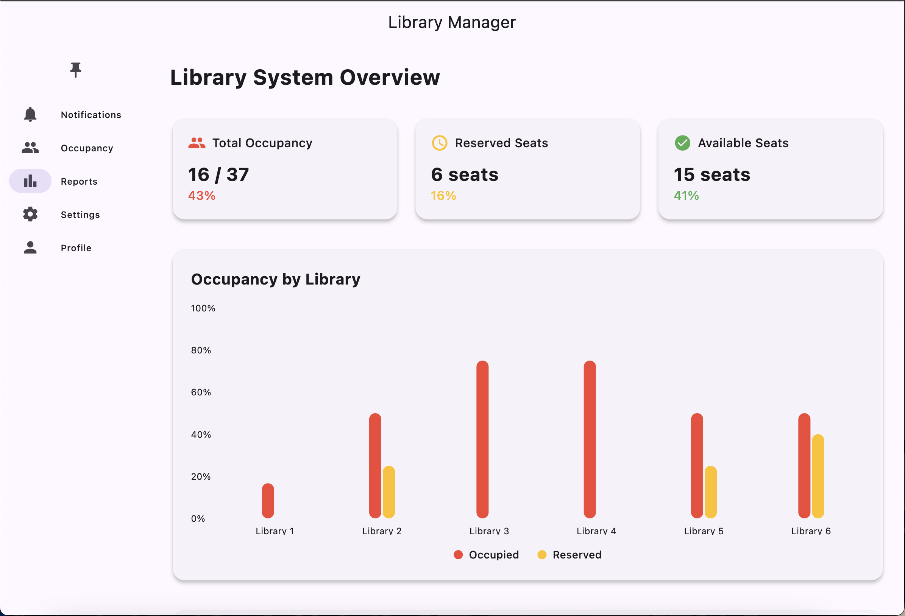
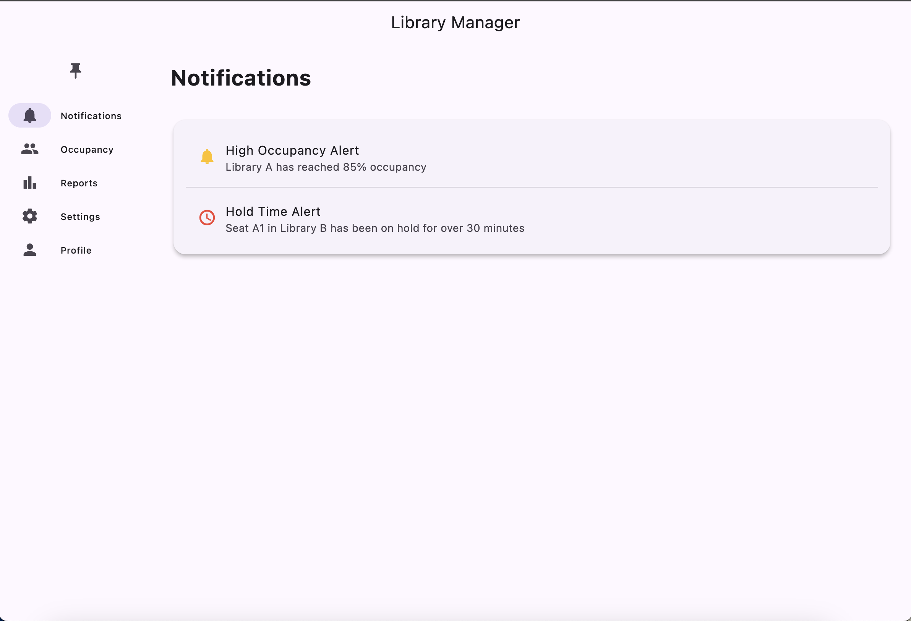
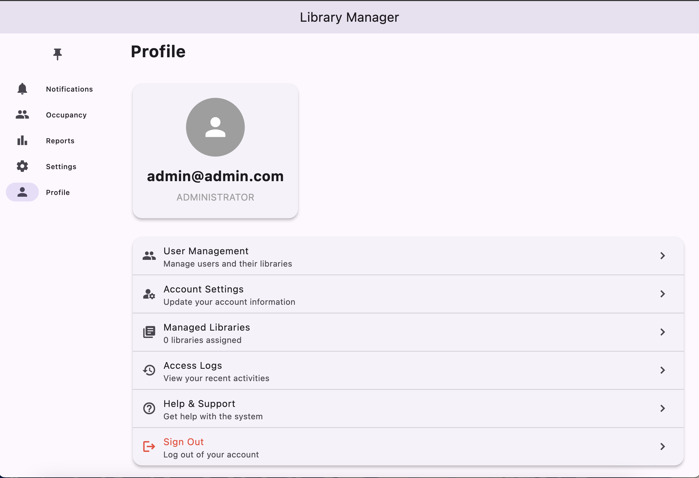
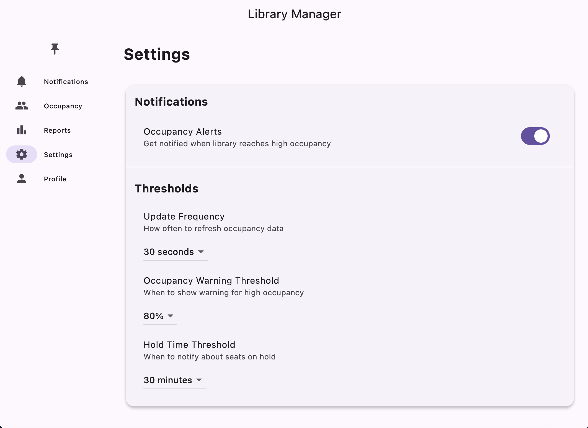

# Library Occupancy Dashboard (LOD)

A Flutter application for managing and monitoring library occupancy in real-time.

## Screenshots

### Login Screen



### Dashboard



### Occupancy Management



### Analysis & Reports



### Notifications



### Profile Management



### Admin Settings



## Features

### Authentication ✅

- User registration with email/password
- User login with email/password
- Different user roles (administrator, user)
- Profile management
- Session persistence

### Navigation ✅

- Responsive side navigation
- Pinnable navigation drawer
- Quick access to all main features

### Occupancy Management ✅

- Real-time occupancy monitoring
- Visual occupancy indicators
- Seat status tracking (available, occupied, reserved)
- Library selection and filtering
- Occupancy rate calculations
- Graphical representation with charts

### Library Management ✅

- Multiple library support
- Library details view
- Seat management for each library
- Library assignment to users
- Occupancy statistics

### Settings & Customization ✅

- Configurable refresh intervals (5s, 10s, 30s, 60s)
- Adjustable occupancy warning thresholds
- Customizable hold time limits
- Notification preferences

### Notifications ✅

- High occupancy alerts
- Hold time exceeded notifications
- Real-time status updates
- Configurable notification settings

### Reports 🚧

- Occupancy trends (in progress)
- Usage statistics (in progress)
- Peak hours analysis (planned)
- Historical data (planned)

### Database ✅

- SQLite integration for local storage
- User data persistence
- Settings storage
- Library data management

### Cross-Platform Support ✅

- Desktop support (Windows, macOS, Linux)
- Mobile support (iOS, Android) - UI optimized
- Responsive design for all screen sizes

## Technical Details

### Dependencies

- flutter_local_notifications: For local notifications
- provider: For state management
- sqflite: For local database
- sqflite_common_ffi: For desktop database support
- fl_chart: For charts and graphs
- path: For file path management

### Architecture

- Provider pattern for state management
- Repository pattern for data access
- Service-based architecture for business logic
- Clean separation of concerns

### Database Schema

- Users table: For user management and authentication
- Settings table: For application settings
- Libraries table: For library data (managed through Firebase)

## Setup Instructions

1. Clone the repository
2. Install Flutter (latest stable version)
3. Install dependencies:
   ```bash
   flutter pub get
   ```
4. Run the application:
   ```bash
   flutter run
   ```

## Default Credentials

- Administrator:
  - Email: admin@admin.com
  - Password: admin123

## Known Issues

1. Firebase initialization warning on desktop platforms (non-critical)
2. Initial database setup required for first run

## Upcoming Features

1. Advanced reporting system
2. User activity logs
3. Export functionality for reports
4. Batch operations for library management
5. Enhanced notification system

## Contributing

Contributions are welcome! Please feel free to submit pull requests.

## License

This project is licensed under the MIT License - see the LICENSE file for details.
